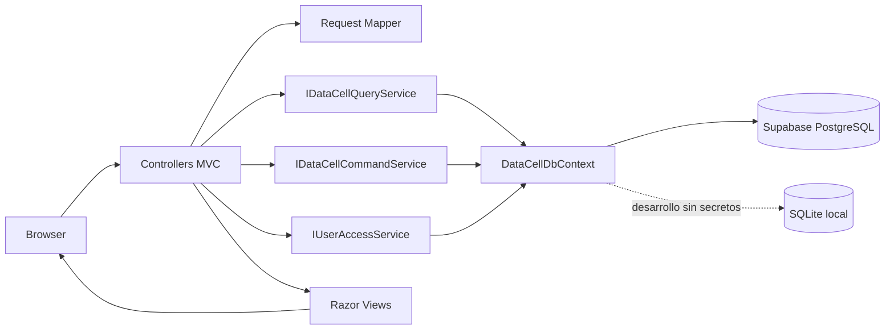

# Arquitectura de software

## Objetivo

DataCell implementa ventas, pagos, compras, recepciones, inventario, cotizaciones y reclamos sin mezclar estado de interfaz con persistencia. El proyecto conserva MVC y agrega una separacion explicita entre lectura, comandos y acceso a datos.

## Responsabilidades

- **Controllers**: autorizan, reciben HTTP, delegan el caso de uso y eligen la vista. No contienen consultas ni reglas de persistencia.
- **Mapping y Requests**: convierten formularios dinamicos a objetos tipados, normalizan opciones, agrupan productos repetidos y limitan cantidades.
- **Query service**: compone modelos de vista con consultas `AsNoTracking` y carga solo los conjuntos solicitados.
- **Command service**: concentra reglas del negocio y transacciones. Una venta actualiza venta, detalle, pago, stock y movimiento como una unidad atomica.
- **Data**: entidades y configuraciones EF Core independientes de la interfaz.
- **Views**: renderizan y recopilan datos; no acceden a la base.

## Decisiones de calidad

- Dependencias por interfaces y ciclo de vida `Scoped`.
- Consultas y operaciones asincronas con `CancellationToken`.
- Hash de claves mediante `PasswordHasher` de ASP.NET Core.
- Cookie `HttpOnly`, `SameSite=Lax` y transporte seguro cuando se usa HTTPS.
- Cadenas de conexion fuera del repositorio mediante User Secrets o variables de entorno.
- PostgreSQL como persistencia objetivo y SQLite solamente como fallback de desarrollo.
- Restricciones e integridad en dos capas: reglas del servicio y constraints de base de datos.
- Analizadores del SDK habilitados y compilacion bloqueada ante advertencias.
- Roles centralizados en `Security/DataCellAuthorization.cs` y permisos expresados como politicas, evitando cadenas de autorizacion dispersas.

## Limites

El modelo se aloja en `public` para que todas las tablas sean visibles directamente en Table Editor. Como `public` es un esquema expuesto por Supabase, RLS permanece habilitado en cada tabla y se revocan todos los privilegios de `anon` y `authenticated`. La aplicacion MVC accede mediante una conexion PostgreSQL exclusiva del backend.
