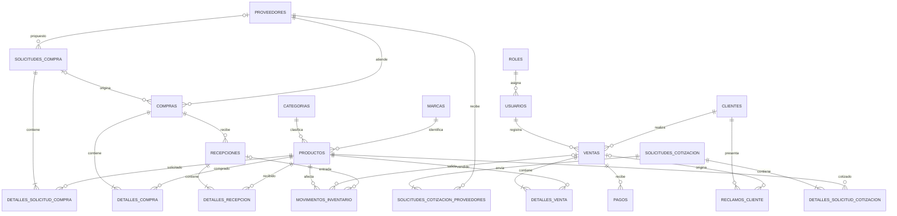

# Modelo de datos

## Correcciones realizadas

- `pagos` se separo de `ventas`, permitiendo conciliacion y multiples pagos por comprobante.
- La cotizacion y el proveedor ahora tienen una relacion muchos-a-muchos mediante `solicitudes_cotizacion_proveedores`.
- El proveedor de una solicitud de compra es opcional hasta su seleccion o aprobacion.
- `compras` puede rastrear la solicitud de compra que la origino.
- Una compra admite varias recepciones; cada recepcion registra usuario, guia, detalle y movimientos.
- Los movimientos de inventario referencian su venta o recepcion de origen.
- Se agregaron unicidad, checks, claves foraneas e indices en columnas de busqueda y relacion.
- Fechas de eventos usan `timestamptz`; fechas puramente calendarias usan `date`.

## Reconciliacion de datos heredados

El SQL MySQL y el antiguo estado en memoria contenian claves iguales para registros diferentes. Para no perder filas ni violar unicidad se aplicaron estas reglas, tanto en Supabase como en el fallback local:

| Conflicto de origen | Resolucion |
|---|---|
| `PROD-001` y `PROD-002` representaban productos distintos en MySQL y en la aplicacion | Los productos MySQL se preservan como `MYSQL-PROD-001` y `MYSQL-PROD-002`; conservan sus codigos de barras. Los productos del prototipo conservan su codigo y quedan sin un codigo de barras inventado. |
| El RUC `20123456789` identificaba dos proveedores distintos | Se conserva para `Tecnologia Peru S.A.C.` y `Proveedor Demo SAC` se importa con el identificador tecnico `20999999991`, pendiente de validacion con el RUC real. |
| Las claves de usuarios estaban en texto plano aunque la columna se llamaba `passwordHash` | Se reemplazan por hashes compatibles con `PasswordHasher` de ASP.NET Core. |

Tambien se incorporan el cliente y proveedor demo del SQL, ademas del catalogo y los datos operativos que antes solo existian en memoria.

## Relaciones principales

## Seguridad y rendimiento

El modelo esta en `public` para facilitar su inspeccion desde Table Editor. Dado que este esquema puede estar expuesto al Data API, se revoca el acceso de `anon` y `authenticated` y se habilita RLS en cada tabla. Los indices cubren claves foraneas y filtros recurrentes por fecha, estado, producto, cliente y proveedor. Los importes usan `numeric(12,2)` y las cantidades/stock tienen restricciones no negativas.

La fuente ejecutable del modelo es la secuencia ordenada de `supabase/migrations/`. La migracion inicial crea y carga el modelo; las migraciones posteriores reconcilian roles/permisos y mueven las tablas a `public`. Los cambios futuros deben agregarse como nuevas migraciones; nunca se debe editar una migracion ya aplicada a produccion.
